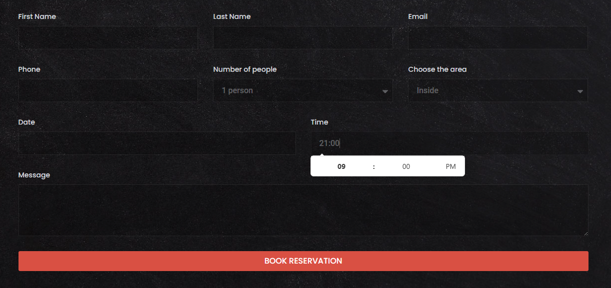

# restaurant

1. Home (lading)
   

   Cabecera 
   nav
    - boton login
    - ver la carta
    - hacer reserva (solo si login es correcto)

   minimo: 
   - foto del restaurante (de paella) + texto descriptivo

   foooter
   - telefono, direción. 
   - horario de apertura

2. Página login
   Permite registrar 5 usuarios
   formulario
   - usuario 
   - contraseña

3. Página de reservas 
   Formulario con horarios y fechas disponibles 
   campo para seleeccionar dia y otro para la hora
   Paracido a este

   

    al pulsar en confirmar -> mostrar ventan con los datos de la reserva. 

4. Carta del memú. 

Tabla con la siguiente información. 

Entrantes
Pan con tomate y jamón — 4.50€
Croquetas de la abuela (6 uds) — 7.00€
Ensalada mixta — 6.50€
Tabla de quesos — 9.00€
Principales
Lubina a la plancha con verduras — 16.00€
Arroz caldoso de marisco — 18.00€
Entrecot con patatas bravas — 19.50€
Pasta al pesto con gambas — 14.00€
Postres
Tarta de queso casera — 5.50€
Brownie con helado — 5.00€
Fruta de temporada — 4.00€
Bebidas
Agua, refrescos — 2.00€
Cerveza — 2.50€
Copa de vino — 3.50€
Café — 1.80€

## Recursos

-Para las imágenes
-Unsplash (unsplash.com) → calidad altísima, gratis, sin atribución. Buscan "paella", "grilled fish", "restaurant"
-Pexels (pexels.com) → igual de bueno, muy fácil de usar
-TheFoodieHub o FoodiesFeed (foodiesfeed.com) → especializado en comida, perfecto para platos

### Cambiar de página

window.location.href = 'url

## Colores

    --e-global-color-primary: #6EC1E4;
    --e-global-color-secondary: #54595F;
    --e-global-color-text: #7A7A7A;
    --e-global-color-accent: #61CE70;
    --e-global-color-453b1ca: #D95043;
    --e-global-color-45ebfa1: #919191;
    --e-global-color-3c9e2c4: #6EB191;
    --e-global-typography-primary-font-family: "Roboto";

    